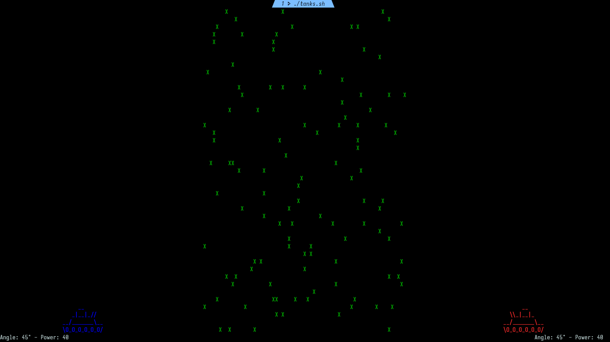

# Tank Game

Back in the early 1990s, when I was a small child, a family friend showed me
a game on what I think was an Apple PowerBook. This is a Bash implementation
inspired by that game. Since I was very young at the time, my memory may not
be entirely accurate, and some details may differ.



## Usage

Run `bash tank.sh`.

```Bash
The objective is to destroy the enemy tank.

Controls:
  Move Tank:       'a' or Left Arrow (move left)
                   'd' or Right Arrow (move right)

  Adjust Angle:    'w' or Up Arrow (increase angle)
                   's' or Down Arrow (decrease angle)

  Adjust Power:    'm' (increase power)
                   'l' (decrease power)

  Fire Projectile: 'f' or Spacebar

  Quit Game:       'q'
```

Sound playback requires `aplay` (ALSA). However, the game can be played without it.
Sound effects by [dklon](https://opengameart.org/content/boom-pack-2) (OpenGameArt, CC-BY 3.0).

## LICENSE

[MIT](./LICENCE)
